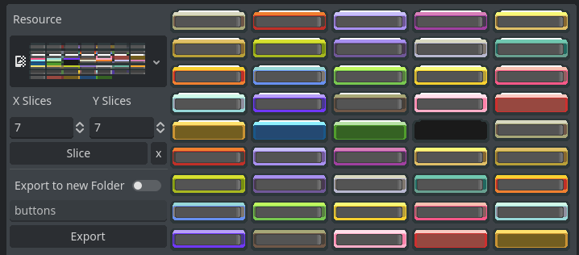

# Godot Slicer

Quick and easy utility to slice a CompressedTexture into multiple AtlasTextures. This is useful for 2D games that use a single texture atlas for all sprites.

This is not thoroughly tested, so use at your own risk. I strongly recommend hacking this to fit your needs. I will not be providing support for this addon.

## Installation

1. Download the latest release from the [releases page](https://github.com/lilykiwi/godot-slicer/releases).
2. Extract the zip file into your project's `addons` folder.
3. Enable the plugin in your project settings.

## Usage

1. Click the `Slicer` tab in the editor.
2. Select the `CompressedTexture` you want to slice.
3. Select the slice count for X and Y
4. Click `Slice` to slice the texture.
5. Click `Export` to export the sliced textures.
6. Select the folder where you want to save the sliced textures.

This addon supports creating a subfolder. For example, if you want to save the sliced textures in a folder called `sliced`, you can enter `sliced` in the `Subfolder` field.

## Known Issues

- Currently missing prefix and suffix. This is quite easy to hack in, but I don't need it right now. I'll come back to this at some point.
- The popup UI is unthemed. Not sure how to get the theme from the editor.
- Only works with importing CompressedTextures (.png) and outputting AtlasTextures (.tres). I don't need anything else right now, but I'll add support for other texture types if I need them. Feel free to submit a PR if you need this.
- No scaling on the slicing. 
- Cannot reorder the slices in the UI. You can do this manually by renaming the files (sorry).

## License

[MIT License](LICENSE)
